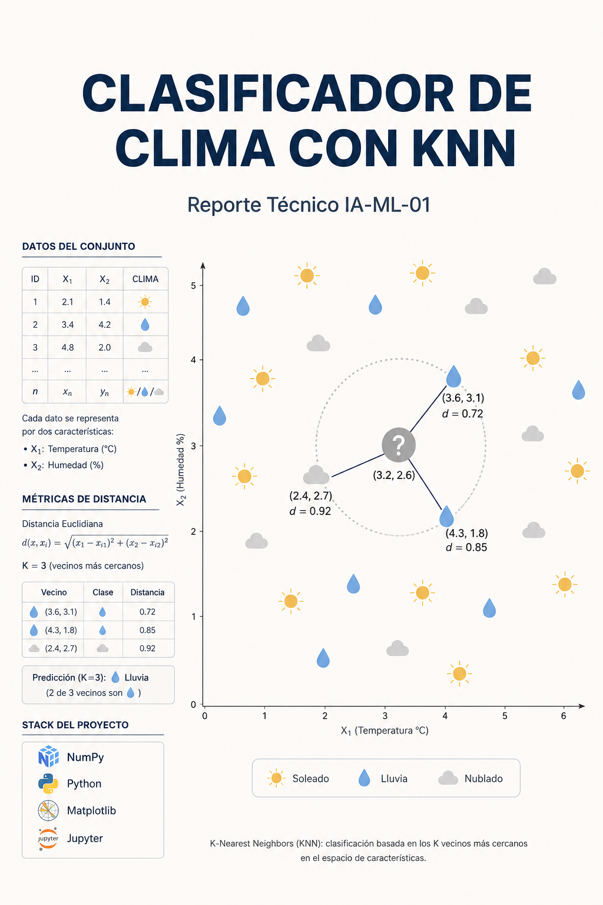

<<<<<<< HEAD
# 01: Weather Classifier with KNN

*Read this in: [Español](README.es.md)*

## Project Overview
The project covers the full supervised classification pipeline: exploratory data analysis (EDA), preprocessing, manual implementation of KNN in pure Python, comparison with scikit-learn, and evaluation using standard metrics.

## Key Objectives
- **Manual Implementation**: Code the KNN logic (Euclidean distance, neighbor voting) without high-level ML libraries.
- **Exploratory Data Analysis (EDA)**: Process and visualize the UCI Weather AUS dataset.
- **Model Evaluation**: Measure performance using Accuracy, Confusion Matrices, and Decision Boundaries.
- **KPI**: Achieve a classification accuracy of **&ge; 80%** on the test set.

## Tech Stack
- **Language**: Python
- **Libraries**: NumPy, Pandas, Matplotlib, Seaborn, scikit-learn.

## Dataset
- **Source**: [UCI Weather in Australia](https://www.kaggle.com/datasets/jsphyg/weather-dataset-rattle-package)
- **Features**: Temperature, Humidity, Pressure, Wind Speed, etc.

## Project Structure
- `01_Exploration_and_KNN.ipynb`: Main development notebook.
- `src/`: (Optional) Python scripts for the manual implementation.
- `reports/`: Technical report in IEEE format.

---
*Developed as part of the Causal Inference & ML Roadmap (May 2026).*
=======
# 01: Clasificador de Clima con KNN

## Área de Conocimiento
Clasificación supervisada (ML clásico)

## Skills Adquiribles
- Implementación manual de K-Nearest Neighbors (KNN) desde cero.
- Preprocesamiento y análisis exploratorio de datos estructurados (CSV).
- Evaluación de modelos de clasificación usando métricas como Accuracy.
- Visualización de fronteras de decisión y curvas de precisión.
- **Stack Tecnológico:** Python, NumPy, Pandas, Matplotlib, scikit-learn.
<<<<<<<< HEAD:01_KNN_Climas/01_KNN_Climas.md
========

>>>>>>>> 26afb5c215eb733930f1e89e56cd349b9d4d38aa:01_KNN_Climas/README.md
>>>>>>> 26afb5c215eb733930f1e89e56cd349b9d4d38aa
